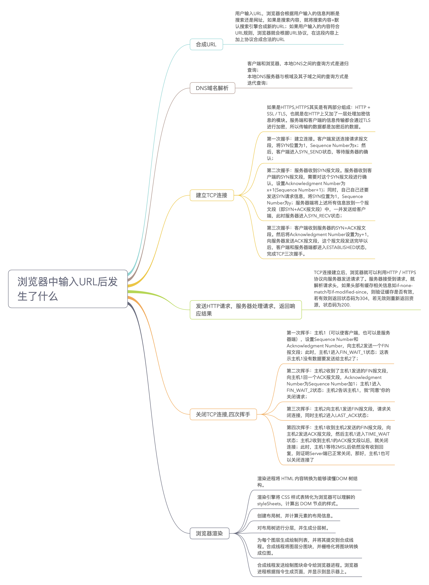

先放一张流传很广的图片

主要有以下几个过程

- DNS 解析
- 发起 TCP 连接
- 发送 HTTP 请求
- 服务器处理请求并返回 HTTP 报文
- 浏览器解析渲染的页面
- 连接结束
- TCP 的四次挥手

## DNS 解析

DNS 解析是一个递归的过程，首先在本地的域名服务器中去查找，如果没有找到就到根域名服务器中去查找，没有找到就再去顶级域名服务器中查找，直到找到对应的 IP 地址。
但是如果每次都像上面一样还是很耗费时间的所以可以使用 DNS 缓存来减少时间。
DNS 存在着多级缓存，从距离浏览器的距离排序的话有以下几种：`浏览器缓存`，`操作系统缓存`，`路由器缓存`，`IPS 服务器缓存`，`根域名服务器缓存`，`顶级域名服务器缓存`，`主域名服务器缓存`。

### 什么是负载均衡

可以发现每次访问同一个网站的时候，比如说`baidu.com`，每次响应的都不一定是同一个服务器，DNS 可以返回一个合适的服务器 IP 地址，这个过程就是负载均衡。

## 发起 TCP 连接

TCP 提供一种可靠的传输，这个过程涉及到三次握手四次挥手

来看一下 TCP 的头部分
首先是 16 位源端口号，16 位目的端口号，32 位序列号，32 位确认号，4 位首部长度，6 位保留位，6 位标志位，16 位窗口大小，16 位校验和，16 位紧急指针，选项，数据

- 源端口和 IP 地址是为了让服务器知道是谁发送的请求
- 目的端口是接收方上计算机的应用程序的端口
- 序号是为了保证数据包的顺序
- 确认号就是 ACK，表明下一个期待收到的字节序号，表明该序号之前所有的数据都已经准确无误的收到，只有当 ACK 标志为 1 的时候才有效，一开始建立连接的时候 SYN 报文的 ACK 为 0
- 首部长度占 4 位
- 保留位
- 控制位
  - URG，当 URG=1 时，表明紧急指针字段有效，紧急指针指向的数据应该尽快传送
  - 确认 ACK，当 ACK=1 时，确认号字段有效，表明确认号字段有效
  - PSH，当 PSH=1 时，表明数据包应该尽快传送给接收方的应用程序
  - RST，当 RST=1 时，表明 TCP 连接中出现严重错误，需要重新建立连接
  - SYN，当 SYN=1 时，表明这是一个连接请求或连接接受报文
  - FIN，当 FIN=1 时，表明发送方已经发送完数据，要求释放连接

### 三次握手

第一次握手：
用户端发送 SYN 报文，将 SYN 标志位设为 1，SeqNum 为 x，表示客户端的初始序列号。用户端进入 SYN_SEND 状态，等待服务器确认。
第二次握手
服务器端收到 SYN 报文，需要确认客户的 SYN，同时自己也发送一个 SYN 报文，将 ACK 标志位设为 1，ACKNum 为 x+1，SeqNum 为 y，表示服务器的初始序列号。服务器端进入 SYN_RECV 状态。
第三次握手
客户端收到服务器的 SYN 报文，向服务器发送确认报文，将 ACK 标志位设为 1，ACKNum 为 y+1，SeqNum 为 x+1，服务器收到这个报文之后，双方进入 ESTABLISHED 状态，完成三次握手。
